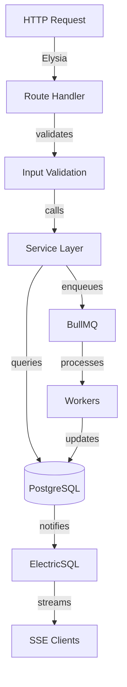

# API Architecture

**Application**: Agios API Server
**Framework**: ElysiaJS
**Port**: 3000
**Runtime**: Bun with --hot flag for development

---

## 🎯 Core Concepts

### Modular Architecture
Each feature is a self-contained module with:
- `routes.ts` - HTTP endpoints
- `service.ts` - Business logic
- `types.ts` - TypeScript interfaces

### Hot Reload
Development server uses `bun --hot src/index.ts` for instant updates.
No build step needed - saves automatically reload.

---

## 📁 Module Structure

```
apps/api/
├── src/
│   ├── index.ts                 # Main server entry
│   ├── modules/
│   │   ├── hook-events/         # Hook event ingestion
│   │   │   ├── routes.ts        # POST /api/v1/hook-events
│   │   │   └── service.ts       # Event processing
│   │   ├── sessions/            # Session management
│   │   │   └── routes.ts        # Session endpoints
│   │   ├── todos/               # Todo streaming
│   │   │   └── routes.ts        # SSE streaming
│   │   ├── agents/              # Agent management
│   │   │   └── routes.ts        # Agent endpoints
│   │   └── crm/                 # CRM features
│   │       ├── routes/
│   │       │   ├── scoring.ts  # Lead scoring (Sprint 4)
│   │       │   ├── routing.ts  # Lead routing (Sprint 5)
│   │       │   ├── intent.ts   # Intent detection (Sprint 5)
│   │       │   └── health.ts   # Health scoring (Sprint 5)
│   │       └── index.ts        # CRM module aggregator
│   ├── lib/
│   │   ├── db.ts               # Database connection
│   │   ├── queue.ts            # pg-boss job queue
│   │   └── electric.ts         # ElectricSQL client
│   ├── services/
│   │   └── ai/                 # AI services (Sprint 4-5)
│   │       ├── prediction-service.ts  # Lead prediction
│   │       ├── scoring-service.ts     # Lead scoring
│   │       ├── routing-service.ts     # Lead routing
│   │       ├── intent-detection-service.ts # Intent
│   │       └── health-service.ts      # Health scoring
│   └── workers/
│       ├── summarize-event.ts  # AI summarization
│       ├── extract-todos.ts    # Todo extraction
│       ├── enrich-lead.ts      # Lead enrichment (Sprint 4)
│       ├── train-model.ts      # Model training (Sprint 4)
│       ├── predict-lead.ts     # Lead prediction (Sprint 4)
│       ├── route-lead.ts       # Lead routing (Sprint 5)
│       ├── calculate-intent.ts # Intent calc (Sprint 5)
│       └── calculate-health.ts # Health calc (Sprint 5)
└── package.json
```

---

## 🔑 Critical Endpoints

### `/api/v1/hook-events` (POST)
**Purpose**: Receive events from hooks SDK
**Authentication**: OPTIONAL for localhost
**Critical Code**:
```typescript
// No auth required for localhost
if (request.headers.get('host')?.includes('localhost')) {
  // Process without auth
}
```

### `/api/v1/hook-events/recent` (GET)
**Purpose**: Get recent events
**Query Params**: `projectId`, `limit`

### `/api/v1/hook-events/stream` (SSE)
**Purpose**: Real-time event stream
**Uses**: ElectricSQL shapes

---

## 🤖 AI Features Endpoints (Sprint 4-5)

### Lead Enrichment & Prediction (Sprint 4)
- **POST** `/api/v1/crm/enrichment/enrich/{leadId}` - Trigger AI enrichment
- **GET** `/api/v1/crm/predictions/{leadId}` - Get conversion prediction
- **POST** `/api/v1/crm/predictions/train` - Train prediction model
- **POST** `/api/v1/crm/predictions/batch` - Batch predictions
- **GET** `/api/v1/crm/scoring/{leadId}` - Get lead score

### Lead Routing (Sprint 5)
- **POST** `/api/v1/crm/routing/leads/{leadId}` - Route lead to agent
- **GET** `/api/v1/crm/routing/agents/capacity` - Agent capacity overview
- **GET** `/api/v1/crm/routing/history/{leadId}` - Routing history
- **POST** `/api/v1/crm/routing/rules` - Create routing rules

### Intent Detection (Sprint 5)
- **GET** `/api/v1/crm/intent/leads/{leadId}` - Get intent score
- **POST** `/api/v1/crm/intent/leads/{leadId}/calculate` - Calculate intent
- **POST** `/api/v1/crm/intent/leads/{leadId}/signals` - Track signal
- **GET** `/api/v1/crm/intent/top-leads` - High intent leads

### Health Scoring (Sprint 5)
- **GET** `/api/v1/crm/health/leads/{leadId}` - Get health score
- **POST** `/api/v1/crm/health/leads/{leadId}/calculate` - Calculate health
- **GET** `/api/v1/crm/health/at-risk` - At-risk leads
- **GET** `/api/v1/crm/health/dashboard` - Health overview

### Email Communication (Growthfin)
- **GET** `/api/v1/crm/activities` - List activities with filtering
  - Query params: `workspaceId`, `leadId`, `type`, `contactId`, etc.
  - Returns filtered and sorted activities
- **GET** `/api/v1/crm/email-templates` - List email templates
  - Query params: `workspaceId`, `category`, `isActive`
  - Returns email templates for composing messages

---

## 🔄 Request Flow



---

## 💾 Database Integration

### Connection
```typescript
// lib/db.ts
import { drizzle } from 'drizzle-orm/postgres-js';
import postgres from 'postgres';

const sql = postgres(process.env.DATABASE_URL!);
export const db = drizzle(sql);
```

### Migrations
```bash
bun run db:generate  # Generate from schema changes
bun run db:migrate   # Apply to database
```

---

## 🔄 Real-time Streaming

### ElectricSQL Integration
- Runs on port 3001
- Provides SSE endpoints for all tables
- Use `offset=now` for new events only

### SSE Pattern
```typescript
// Get initial state
GET /api/v1/resource

// Stream deltas
GET http://localhost:3001/streams/table_name?offset=now
```

---

## 👷 Background Workers

### pg-boss Queue (Updated from PGBoss)
- PostgreSQL-based job queue
- Processes jobs asynchronously
- Retries on failure with exponential backoff
- Singleton support for unique jobs

### Worker Jobs (Sprint 4-5 Additions)
**Original Workers:**
- `summarize-event` - AI summarization of hook events
- `extract-todos` - Extract todos from events
- `generate-title` - Generate todo titles

**Sprint 4 AI Workers:**
- `enrich-lead` - AI-powered lead enrichment
- `train-prediction-model` - Train ML models for predictions
- `predict-lead` - Generate conversion predictions
- `batch-predict` - Batch prediction processing
- `calculate-lead-score` - Calculate lead scores

**Sprint 5 AI Workers:**
- `route-lead` - Automated lead routing to agents
- `calculate-intent` - Calculate buying intent scores
- `calculate-health` - Calculate lead health scores

### Worker Registration Pattern
```typescript
// Correct pattern (Sprint 5 fix)
export function registerWorker() {
  // Import jobQueue directly, no parameters
  jobQueue.work('job-name', async (job) => {
    // Process job
  });
}
```

---

## 🔒 Authentication

### Localhost (Development)
- **NO authentication required**
- Empty Authorization header accepted
- Allows rapid development

### Production
- Bearer token required
- Token validated against database
- Rate limiting applied

---

## 🐛 Common Issues

### "Port 3000 already in use"
```bash
lsof -i :3000
pkill -f "bun.*api"
```

### "Hot reload not working"
- Check for syntax errors
- Verify `--hot` flag is present
- Restart server if stuck

### "Database connection failed"
```bash
# Check PostgreSQL running
docker ps | grep postgres

# Verify connection string
echo $DATABASE_URL
```

---

## 📋 Testing Endpoints

### Health Check
```bash
curl http://localhost:3000/health
```

### Send Hook Event (No Auth)
```bash
curl -X POST http://localhost:3000/api/v1/hook-events \
  -H "Content-Type: application/json" \
  -d '{"projectId":"0ebfac28-1680-4ec1-a587-836660140055","sessionId":"test"}'
```

### Get Recent Events
```bash
curl "http://localhost:3000/api/v1/hook-events/recent?projectId=0ebfac28-1680-4ec1-a587-836660140055"
```

---

## ⚠️ Critical Knowledge

1. **Localhost doesn't require auth** - This was the bug!
2. **Hot reload is automatic** - No build needed
3. **Workers run async** - Don't block requests
4. **Use ElectricSQL for streaming** - Not custom SSE

---

## 📚 Related Documentation

- Database schema: [`packages/db/SCHEMA.md`](../../packages/db/SCHEMA.md)
- ElectricSQL setup: [`docs/ELECTRICSQL-STREAMING.md`](../../docs/ELECTRICSQL-STREAMING.md)
- Module-specific docs: Each module's README.md