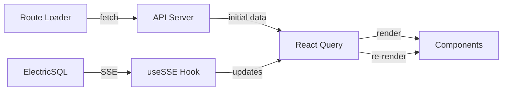

# Web Dashboard Architecture

**Application**: Agios Web Dashboard
**Framework**: React Router v7
**Port**: 5173
**State Management**: TanStack Query + SSE

---

## 🎯 Core Concepts

### React Router v7
- File-based routing in `app/routes/`
- Loaders for data fetching
- Actions for mutations

### Real-time Updates
- Initial state from GET endpoints
- Delta updates via SSE (ElectricSQL)
- No polling - push-based updates

---

## 📁 Directory Structure

```
apps/web/
├── app/
│   ├── routes/              # File-based routes
│   │   ├── _index.tsx       # Home page
│   │   ├── dashboard._index.tsx
│   │   ├── dashboard.project.$projectId._index.tsx
│   │   └── dashboard.project.$projectId.agent.$agentType._index.tsx
│   ├── components/          # Reusable UI components
│   │   ├── ui/             # shadcn/ui components
│   │   └── custom/         # App-specific components
│   ├── hooks/              # Custom React hooks
│   │   ├── useHookEvents.ts
│   │   ├── useSessions.ts
│   │   └── useSSE.ts      # SSE streaming hook
│   └── lib/
│       ├── api.ts          # API client
│       └── utils.ts        # Utilities
├── public/                 # Static assets
└── vite.config.ts         # Vite configuration
```

---

## 🛣️ Routing Pattern

### File-based Routes
```
dashboard.project.$projectId.agent.$agentType._index.tsx
↓
URL: /dashboard/project/123/agent/main
```

### Route Parameters
- `$projectId` - Dynamic segment
- `$agentType` - Another dynamic segment
- `_index` - Index route for that path

---

## 🔄 Data Flow



---

## 📡 Real-time Streaming

### useSSE Hook Pattern
```typescript
const { data, isConnected } = useSSE({
  url: 'http://localhost:3001/streams/hook_events',
  offset: 'now',  // Only new events
  onMessage: (event) => {
    // Update React Query cache
    queryClient.setQueryData(['events'], old => [...old, event]);
  }
});
```

### CQRS Pattern
1. **Query**: GET initial state
2. **Stream**: SSE for updates
3. **Merge**: Combine in React Query cache

---

## 🎨 Component Architecture

### Page Components
Located in `routes/`, handle:
- Data loading
- Layout
- Route params

### UI Components
Located in `components/ui/`, from shadcn:
- Button, Card, Table, etc.
- Consistent styling
- Accessibility built-in

### Feature Components
Located in `components/`, domain-specific:
- HookEventsList
- SessionCard
- AgentSelector
- CommunicationTimeline (CRM)
  - Email communication history display
  - Two-column layout (35/65 split)
  - Email metadata + body preview
  - Real-time filtering by leadId

---

## 🔐 Authentication & Proxy Architecture

### Authentication Flow
**Route**: `app/routes/auth.sign-in.tsx`

```typescript
// React Router Form action pattern
export const action: ActionFunction = async ({ request }) => {
  // 1. Parse form data
  const formData = await request.formData();

  // 2. Call API directly (server-side action)
  const response = await fetch(`${API_URL}/auth/sign-in/email`, {
    method: "POST",
    headers: { "Content-Type": "application/json" },
    body: JSON.stringify({ email, password }),
  });

  // 3. Forward session cookie to client
  const setCookieHeader = response.headers.get("set-cookie");
  return redirect("/dashboard", {
    headers: { "Set-Cookie": setCookieHeader }
  });
};
```

**Key Principles:**
- Actions run server-side (can call API directly at localhost:3000)
- Session cookies must be explicitly forwarded to client
- Works for both localhost and LAN access (192.168.x.x)

### API Proxy Routes
**Purpose**: Enable client-side code to call API without CORS issues

**Generic Proxy**: `app/routes/api.v1.$.ts`
```typescript
// Proxies all /api/v1/* requests to backend
export async function loader({ request, params }) {
  const path = params["*"];
  const backendUrl = `${API_URL}/api/v1/${path}`;

  // Forward request with cookies
  return fetch(backendUrl, {
    headers: {
      "Cookie": request.headers.get("cookie") || "",
    }
  });
}
```

**Auth Proxy**: `app/routes/api.auth.$.ts`
```typescript
// Proxies /api/auth/* requests to backend
// Used for client-side authentication checks
```

**Proxy Pattern Benefits:**
- ✅ No CORS configuration needed
- ✅ Works across all network interfaces (localhost, LAN, VPN)
- ✅ Cookies automatically included in same-origin requests
- ✅ Consistent API access from client and server code

**Architecture Rule:**
- 🔴 **Client-side code**: MUST use proxy routes (`/api/*`)
- 🟢 **Server-side code** (loaders/actions): CAN call API directly (`localhost:3000`)

---

## 🔑 Key Hooks

### `useHookEvents()`
```typescript
// Fetches and streams hook events
const { events, isLoading } = useHookEvents({
  projectId,
  agentType,
  realtime: true
});
```

### `useSSE()`
```typescript
// Generic SSE streaming hook
const stream = useSSE({
  url: 'http://localhost:3001/streams/table',
  offset: 'now'
});
```

---

## 🎯 State Management

### TanStack Query
- Caches API responses
- Handles loading/error states
- Automatic refetching
- Optimistic updates

### SSE Updates
- Real-time push from server
- Updates Query cache
- Triggers re-renders

---

## 🐛 Common Issues

### "Page not updating with new data"
1. Check SSE connection in Network tab
2. Verify ElectricSQL running: `curl localhost:3001/health`
3. Check console for errors

### "Build errors"
```bash
cd apps/web
bun tsc --noEmit  # Check TypeScript
```

### "Hot reload not working"
- Vite handles this automatically
- Check for syntax errors
- Clear browser cache if needed

---

## 📋 Testing

### Development Server
```bash
cd apps/web
bun run dev
# Opens http://localhost:5173
```

### Build for Production
```bash
bun run build
bun run preview  # Test production build
```

### Browser Testing Checklist
- [ ] No console errors
- [ ] SSE connections established
- [ ] Real-time updates working
- [ ] All routes accessible

---

## ⚠️ Critical Knowledge

1. **SSE from ElectricSQL** - Port 3001, not API
2. **File-based routing** - File name = route path
3. **React Query cache** - Single source of truth
4. **No polling** - Everything is push-based

---

## 🎨 UI Components (shadcn/ui)

### Installation
```bash
bunx shadcn@latest add [component]
```

### Available Components
- Accordion, Alert, Button, Card
- Table, Tabs, Toast
- Form components with react-hook-form

---

## 📚 Related Documentation

- React Router v7: [Official docs](https://reactrouter.com)
- TanStack Query: [`app/hooks/README.md`](app/hooks/README.md)
- SSE Patterns: [`docs/SSE-PATTERNS.md`](../../docs/SSE-PATTERNS.md)